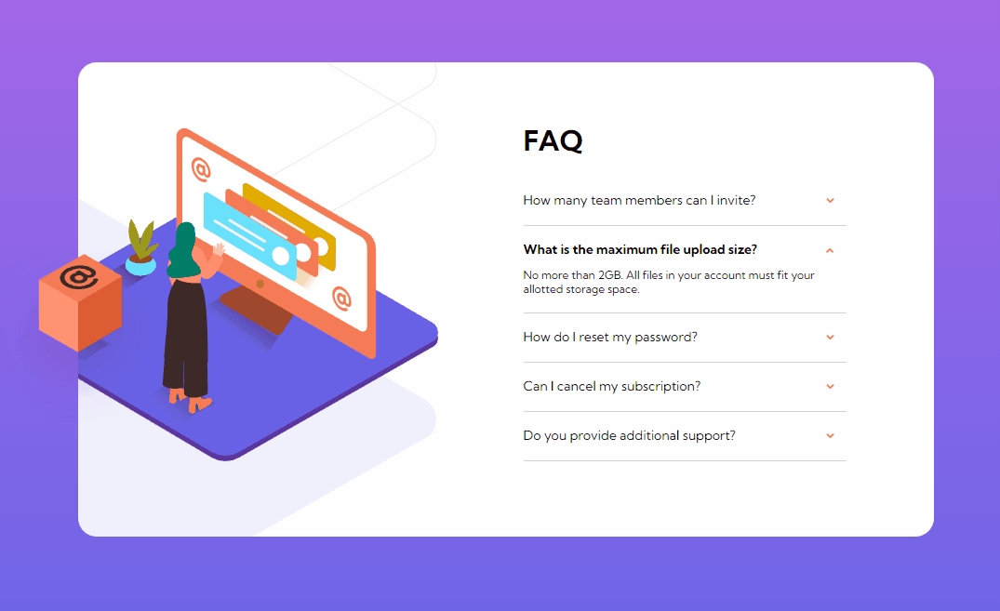
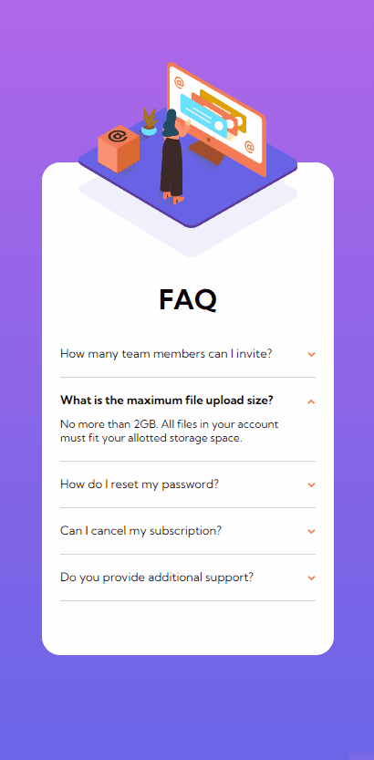

# Desafio do frontend mentor - FAQ accordion card

Esta é uma solução para o [Desafio FAQ accordion card do Frontend Mentor](https://www.frontendmentor.io/challenges/faq-accordion-card-XlyjD0Oam).

## Índice

- [Visão geral](#visão-geral)
  - [Desafio](#desafio)
  - [Screenshot](#screenshot)
  - [Links](#links)
- [Meu processo](#meu-processo)
  - [Tecnologias utilizadas](#tecnologias-utilizadas)
  - [Desenvolvimento](#desenvolvimento)
- [Autor](#autor)
- [Agradecimentos](#agradecimentos)

## Visão geral

### Desafio

- criar o layout ideal para o projeto, dependendo do tamanho da tela do dispositivo.
- adicionar o efeito de hover para todos os elementos interativos na página.
- ocultar/Mostrar a resposta de uma pergunta quando a pergunta é clicada.

### Screenshot

#### Desktop

#### Mobile

### Links

- URL da página: [FAQ accordion card](https://alexjr53.github.io/faq-accordion-card/) 
- solução do projeto no frontend mentor: [FAQ accordion card](https://www.frontendmentor.io/challenges/faq-accordion-card-XlyjD0Oam/hub/faq-accordion-card-mzuox3xiE_)

## Meu processo

### Tecnologias utilizadas

- HTML
- CSS
- Javascript

### Desenvolvimento

Atualmente estou usando desafios do frontend mentor apenas para praticar, aprimorando assim meus conhecimentos de HTML e CSS, para que no futuro possa aprimorar este e outros projetos também feitos a partir do frontend mentor.

## Autor
Alexsandro rosa junior

- GitHub - [Alexjr53](https://github.com/Alexjr53)

## Agradecimentos
Agradecimentos a equipe [Dev em Dobro](https://www.instagram.com/devemdobro/) que está me passando o conhecimento e conceitos necessários para poder realizar esses desafios.